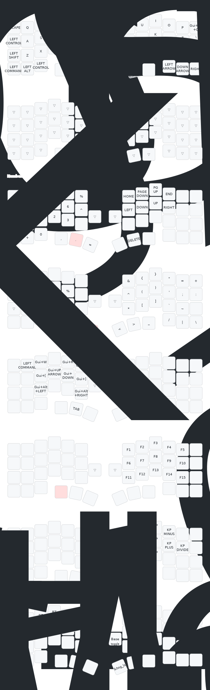

# ZMK Keyboard for Cornix

## How to change keymap

- [Keymap Editor](https://nickcoutsos.github.io/keymap-editor/) 上 で コミット
- ローカルでgit pull
- キーボードを PC に有線で接続する
- zmk-workspace で `just build cornix_left`
- zmk-workspace で `just flash cornix_left`
- 右手側キーボードに対しても同じ手順を踏む

## Keymap

